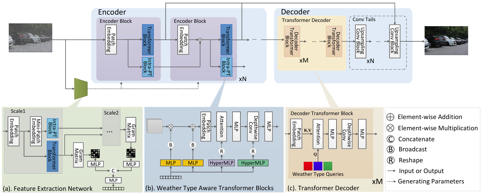
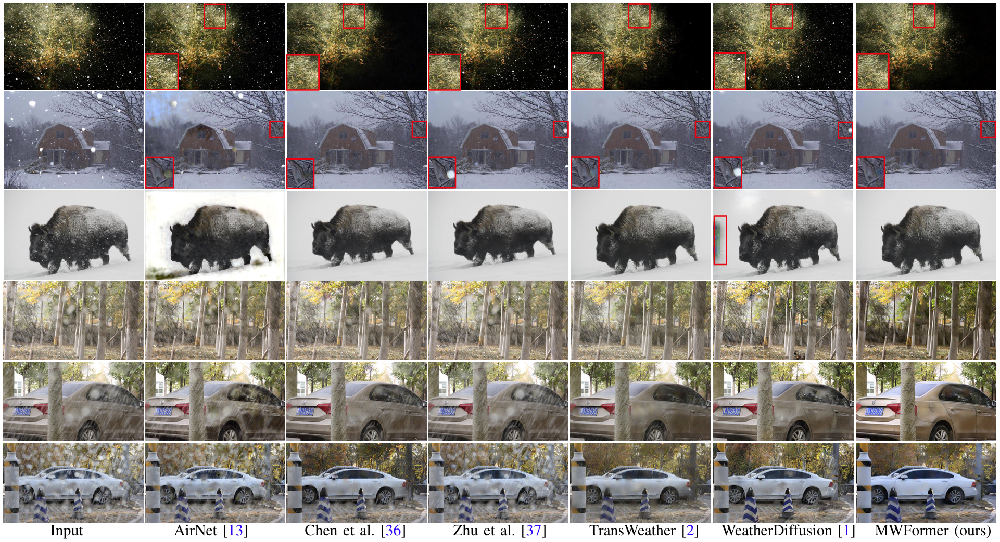

# [TIP2024]  MWFormer: Multi-Weather Image Restoration Using Degradation-Aware Transformers 

This is a PyTorch implementation of the paper [MWFormer: Multi-Weather Image Restoration Using Degradation-Aware Transformers](https://ieeexplore.ieee.org/abstract/document/10767188) published in IEEE TIP 2024. Arxiv [link](https://arxiv.org/abs/2411.17226).

*__Notice__: This repo is still __working in progress__.*

> **Abstract:** *Restoring images captured under adverse weather conditions is a fundamental task for many computer vision applications. However, most existing weather restoration approaches are only capable of handling a specific type of degradation, which is often insufficient in real-world scenarios, such as rainy-snowy or rainy-hazy weather. Towards being able to address these situations, we propose a multi-weather Transformer, or MWFormer for short, which is a holistic vision Transformer that aims to solve multiple weather-induced degradations using a single, unified architecture. MWFormer uses hyper-networks and feature-wise linear modulation blocks to restore images degraded by various weather types using the same set of learned parameters. We first employ contrastive learning to train an auxiliary network that extracts content-independent, distortion-aware feature embeddings that efficiently represent predicted weather types, of which more than one may occur. Guided by these weather-informed predictions, the image restoration Transformer adaptively modulates its parameters to conduct both local and global feature processing, in response to multiple possible weather. Moreover, MWFormer allows for a novel way of tuning, during application, to either a single type of weather restoration or to hybrid weather restoration without any retraining, offering greater controllability than existing methods. Our experimental results on multi-weather restoration benchmarks show that MWFormer achieves significant performance improvements compared to existing state-of-the-art methods, without requiring much computational cost. Moreover, we demonstrate that our methodology of using hyper-networks can be integrated into various network architectures to further boost their performance.*

## Introduction
-  A novel Transformer-based architecture
 called MWFormer for multi-weather restoration, which can restore pictures distorted by multiple adverse weather degradations using a single, unified model.
- A hyper-network is employed to extract content independent weather-aware features that are used to dynamically modify the parameters of the restoration backbone, allowing for degradation-dependent restoration and other related applications.
- The feature vector produced by the hyper-network is leveraged to guide the restoration backbone’s behavior across all dimensions and scales (i.e., locally spatial, globally spatial, and channel-wise modulations).
- Two variants of MWFormer are created—one for lower computational cost, and the other for addressing hybrid adverse weather degradations unseen during training.
-  Comprehensive experiments and ablation studies demon strate the efficacy of the proposed blocks and the superiority of MWFormer in terms of visual and quantitative metrics. We also develop and analyze multi-weather restoration models in the context of downstream tasks.

 ## Architecture
 
The architecture of MWFormer. The main image processing network consists of a Transformer encoder, a Transformer decoder, and convolution tails. (a) A feature extraction network learns to generate some of the parameters of the Transformer blocks and intra-patch Transformer blocks in the main network, thereby partially controlling the production of intermediate feature maps. (b) The Transformer block in the encoder of the main network, which is guided by the feature vector. (c) Transformer decoder of the main network, whose queries are learnable parameters.

## Different Variants
 
In addition to the default architecture, we also developed two test-time variants applied in special cases. To conduct a single weather-type restoration, the feature extraction network is replaced by a fixed feature vector. To conduct hybrid weather restoration that were unseen during training, the image processing network is cascaded to remove degradations sequentially, stage by stage.

## Results
### Results on real world images
  
### Results on hybrid-weather degradations unseen during training
  
### Downstream-task-driven video quality evaluation
Click on the screenshots to play or download the video.

<div style="display: flex; justify-content: space-evenly; width: 100%;">
  <a href="https://drive.google.com/file/d/1NI3mTAAhlk7zAvlHjxe_Dl7OTW4NMLVx/view?usp=drive_link">
    
  </a>
  <a href="https://drive.google.com/file/d/1qtOtD6yoJ7OxM6IWbAai1s-AVtSvJxDV/view?usp=drive_link">
    
  </a>
</div>

## Pre-Trained Models
The weights of MWFormer-real, MWFormer-L and the pre-trained feature extraction network can can be downloaded through this Google Drive [link](https://drive.google.com/file/d/12tP7I1wm7sSI7ZlLBZz78tlrIV-JhsWP/view?usp=sharing).

## Train
First, please download the Allweather dataset and its filelist. The download link and dataset format can be found in this codebase: [link](https://github.com/jeya-maria-jose/TransWeather). 

Then you can train the feature extraction network, train the image restoration backbone, and jointly fine-tune them using the following commands. If you'd like to change more settings or hyper-parameters, please refer to the config files in `./configs/`.
### Train the feature extraction network
``` shell
python main_train_style.py -train_data_dir $YOUR_DATASET_PATH$ -labeled_name $YOUR_DATASET_FILELIST$ -file-name $YOUR_MODEL_NAME$
```
### Train the image restoration backbone
``` shell
python main_train.py -train_data_dir $YOUR_DATASET_PATH$ -labeled_name $YOUR_DATASET_FILELIST$ -restore-from-stylefilter $PRETRAINED_FEATURE_EXTRACTION_NETWORK_PATH$ -file-name $YOUR_MODEL_NAME$
```

### Joint fine-tune
```shell
python main_finetune.py -train_data_dir $YOUR_DATASET_PATH$ -labeled_name $YOUR_DATASET_FILELIST$ -restore-from-stylefilter $PRETRAINED_FEATURE_EXTRACTION_NETWORK_PATH$ -restore-from $PRETRAINED_BACKBONE_PATH$ -file-name $YOUR_MODEL_NAME$
```

## Inference
```shell
python test.py -restore-from-stylefilter $PRETRAINED_FEATURE_EXTRACTION_NETWORK_PATH$ -restore-from-backbone $PRETRAINED_BACKBONE_PATH$ -val_data_dir $TEST_DATASET_PATH$ -val_filename $TEST_DATASET_FILELISE$
```

## Citation
Should you find our work interesting and would like to cite it, please feel free to add this in your references. 
```bibtex
@ARTICLE{10767188,
  author={Zhu, Ruoxi and Tu, Zhengzhong and Liu, Jiaming and Bovik, Alan C. and Fan, Yibo},
  journal={IEEE Transactions on Image Processing}, 
  title={MWFormer: Multi-Weather Image Restoration Using Degradation-Aware Transformers}, 
  year={2024},
  volume={},
  number={},
  pages={1-1},
  keywords={Image restoration;Transformers;Meteorology;Computer architecture;Feature extraction;Degradation;Rain;Decoding;Computer vision;Computational modeling;image restoration;adverse weather;multi-task learning;low-level vision;transformer},
  doi={10.1109/TIP.2024.3501855}}
```

## Acknowledgement
Part of the project is built based on [TransWeather](https://github.com/jeya-maria-jose/TransWeather) and [FIFO](https://github.com/sohyun-l/fifo).
